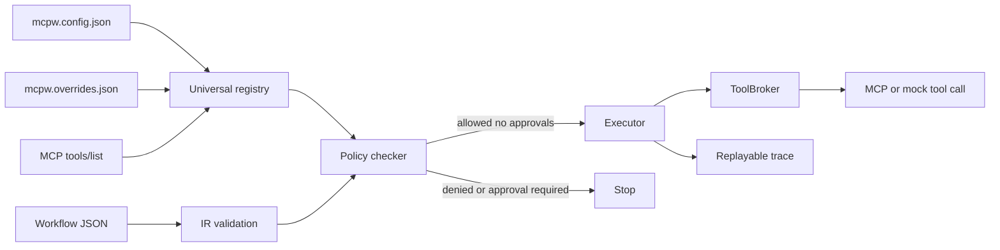

# MCPWarden Architecture

MCPWarden is organized around one boundary: model-proposed workflows are data, and the runtime grants authority only after validation and policy checks.

## Architectural Goals

- Keep the Workflow IR strict and deterministic.
- Treat MCP discovery as capability discovery, not permission.
- Keep policy checking independent from the tool ecosystem that produced a tool.
- Keep execution behind broker interfaces.
- Make local development and local service usage work without hosted infrastructure.
- Fail closed whenever metadata, policy, or source connectivity is incomplete.

## High-Level Flow

## Main Components

### CLI

`src/cli.ts` defines the `mcpw` command. The CLI exposes setup, diagnostics, source inspection, manifest export, workflow checking, workflow planning, workflow execution, and service startup.

Commands:

- `approve issue`
- `approve verify`
- `attacks run`
- `conformance run`
- `dashboard`
- `init`
- `doctor`
- `check`
- `plan`
- `policy init`
- `run`
- `runs list`
- `runs show`
- `security scan`
- `serve`
- `sources list`
- `sources inspect`
- `sources lock`
- `trace graph`
- `manifests export`

### Workflow IR

The IR lives in `src/ir/`. It defines the JSON workflow structure and validates incoming workflows with Zod. Workflows are deliberately declarative. They do not execute arbitrary code and do not self-declare their authority.

### Manifest Registry

The registry lives in `src/manifests/`. It combines:

- built-in demo manifests.
- imported MCP tools.
- source-level defaults.
- tool-specific overrides.

The resulting registry exposes executable `ToolManifest` values to the policy checker.

### MCP Adapter

The MCP adapter lives in `src/adapters/mcpToolsListAdapter.ts`. It supports:

- fixture transport for deterministic tests.
- stdio transport through the official MCP TypeScript SDK.
- HTTP JSON-RPC transport for local or remote MCP-compatible endpoints.

The adapter emits imported tool records with diagnostics. Missing trust and effect metadata keeps the tool inspect-only.

### Policy Checker

The policy checker lives in `src/policy/checker.ts`. It walks workflow steps, infers effects from tool manifests, computes approval requirements, and reports denied effects.

### Executor

The executor lives in `src/runtime/executor.ts`. It runs validated and approved workflows step by step, resolves references, calls tools through a `ToolBroker`, records outputs, and produces a trace.

### Tool Brokers

The broker interface lives in `src/runtime/broker.ts`.

Implemented brokers:

- `MockToolBroker`: deterministic built-in demo calls.
- `McpToolBroker`: routes tool calls to live MCP servers.
- `CompositeToolBroker`: routes selected tools to a primary broker and everything else to a fallback broker.

### Local Service

The local service lives in `src/service/`. It wraps the same validation, registry, policy, and execution pipeline used by the CLI.

The service is localhost-first and intentionally small. It is not a hosted multi-tenant API.

### Hardening Platform

MCPWarden includes focused modules for release hardening:

- `src/policy/packs.ts`: named policy profiles.
- `src/security/threatScanner.ts`: MCP metadata and manifest threat scanning.
- `src/approvals/tokens.ts`: signed approval tokens with expiry and nonce replay protection.
- `src/sources/lockfile.ts`: source lockfiles and schema pinning.
- `src/runs/runStore.ts`: persistent JSONL run records.
- `src/provenance/graph.ts`: workflow dataflow graph generation.
- `src/conformance/suite.ts`: conformance and attack benchmark suites.
- `src/dashboard/dashboard.ts`: local static dashboard rendering.

## Trust And Authority Model

MCPWarden separates four things that are often conflated:

- Discovery: what tools exist.
- Annotation: what trust and effects those tools have.
- Policy: which effects are acceptable.
- Execution: what actually runs.

No source can grant itself authority. Raw MCP metadata is not enough to run a tool.

## Package Shape

The production package is built with `tsconfig.build.json` into `dist/`. The npm package includes runtime files, templates, examples, docs, and `package.json`. It excludes TypeScript source, tests, coverage, and generated test builds.
